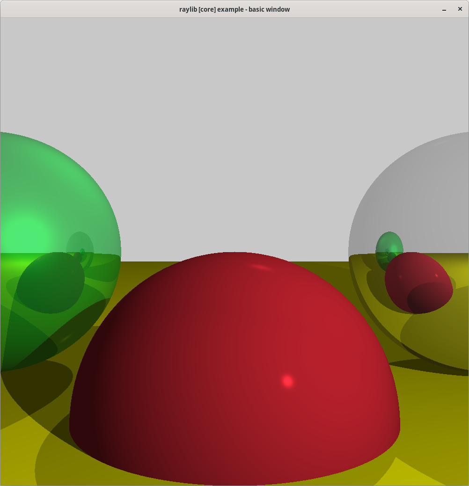

# raytracer

CPU based raytracer using [raylib](https://www.raylib.com/).

## Buliding and running

To build and run the program install [raylib](https://www.raylib.com/) andrun these commands in project directory:
```
make
./raytracer
```

## Screenshots



